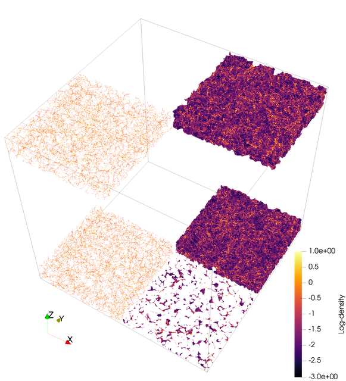

This repository contains my work on the project that I will present at the 2026 Regeneron International Science and Engineering Fair in Phoenix, Arizona.

**Summary**: Pull of gravity and expansion due to dark energy shape the universe into a vast cosmic web composed of:

- Clusters: clusters of galaxies
- Filaments: 1D thread-like structures
- Walls: 2D sheets made of galaxies and gas
- Voids: empty/low density areas

While filaments and clusters are well studied, walls are harder to detect and therefore less understood. Because walls and filaments form at different stages of gravitational collapse, comparing their densities and spatial relationships can improve our understanding of how:

- dark matter organizes large cosmic structures
- galaxies have evolved
- cosmos expands due to dark energy

**Research Question**: How do walls fit into the cosmic web?
How does their density and spatial distribution compare to
other structures?

This project automates the full workflow for extracting, analyzing, and visualizing the cosmic web (walls, filaments, clusters) from N-body simulation snapshots using [DisPerSE](https://www.iap.fr/useriap/sousbie/web/html/indexd41d.html). It takes Gadget/Quijote HDF5 snapshots, runs Morse–Smale topology extraction, produces per-crop statistics and 2D/3D visualizations, and aggregates results across large tiled volumes.





## Documentation Index

| Document | What it covers |
|---|---|
| [Workflow Runbook](documents/WORKFLOW_RUNBOOK.qmd) | End-to-end pipeline runbook: all stages, methods, rationale, troubleshooting |
| [Workflow Flowchart](documents/WORKFLOW_FLOWCHART.qmd) | Mermaid flowchart of the full pipeline |
| [Analyze Snapshot](documents/ANALYZE_SNAPSHOT_USER_GUIDE.qmd) | `analyze_snapshot.py` — full CLI reference |
| [Batch Clip](documents/BATCH_CLIP_USER_GUIDE.qmd) | `batch_clip.py` — slab clipping and PNG rendering |
| [ND Topo Stats](documents/ND_TOPO_STATS_USER_GUIDE.qmd) | `ndtopo_stats.py` — topology overlap stats |
| [Batch Crop + Clip](documents/BATCH_CROP_AND_CLIP_USER_GUIDE.qmd) | `batch_crop_and_clip.py` — full pipeline over tiled crops |
| [Aggregate Topology Points](documents/AGGREGATE_TOPOLOGY_POINTS_USER_GUIDE.qmd) | `aggregate_topology_points.py` + `compare_simulations.py` |
| [Spin Render](documents/SPIN_RENDER_USER_GUIDE.qmd) | `spin_render.py` + `redshift_evolution.py` |
| [Stitch Slab PNGs](documents/STITCH_SLAB_PNGS_USER_GUIDE.qmd) | `stitch_slab_pngs.py` — assemble slab PNGs into MP4s |
| [Other Tools](documents/OTHER_TOOLS_USER_GUIDE.qmd) | `compute_density_field.py`, `export_grid_vti.py`, `export_snapshot_vtu.py` |

## Prerequisites

### Python Environment

```bash
conda create -n disperse -c conda-forge python=3.11 \
  numpy scipy h5py hdf5plugin polars matplotlib
conda activate disperse
```

`hdf5plugin` is required to read Blosc-compressed Quijote snapshots. `polars` is needed for the fast aggregation path. `scipy` is needed for proximity-based alignment in `redshift_evolution.py`.

### DisPerSE Binaries

`analyze_snapshot.py` calls `delaunay_3D`, `mse`, `netconv`, and `skelconv`. Add their build directory to PATH:

```bash
export PATH="/path/to/DisPerSE/build/src:$PATH"
```

See [Build DisPerSE from Source](#build-disperse-from-source) below for macOS build instructions.

### ParaView / pvpython

`batch_clip.py`, `spin_render.py`, and `redshift_evolution.py` must be run via `pvpython` (ParaView's Python interpreter), not standard Python.

To keep `pvpython` on PATH whenever you activate the conda environment:

```bash
mkdir -p "$CONDA_PREFIX/etc/conda/activate.d" "$CONDA_PREFIX/etc/conda/deactivate.d"

cat > "$CONDA_PREFIX/etc/conda/activate.d/paraview_path.sh" <<'EOF'
export _PV_OLD_PATH="$PATH"
export PATH="/usr/bin:/bin:/usr/sbin:/sbin:/Applications/ParaView-6.0.1.app/Contents/bin:$PATH"
EOF

cat > "$CONDA_PREFIX/etc/conda/deactivate.d/paraview_path.sh" <<'EOF'
export PATH="$_PV_OLD_PATH"
unset _PV_OLD_PATH
EOF
```

## Pipeline Overview

```
HDF5 Snapshot
  └─ analyze_snapshot.py          → Delaunay VTU, walls VTU, filaments VTP, cluster VTP
      ├─ ndtopo_stats.py          → topology_stats.csv, topology_points.csv (per crop)
      └─ batch_clip.py            → slab VTUs, 2D VTIs, composite PNGs
              └─ stitch_slab_pngs.py → MP4 movies

batch_crop_and_clip.py            → orchestrates the above across a tiled grid of crops
                                     (per crop: analyze → ndtopo_stats → batch_clip per slab)

aggregate_topology_points.py      → combined stats, histograms, and plots across all crops
compare_simulations.py            → side-by-side boxplots across two simulation runs

spin_render.py                    → rotating 3D animation of any VTK dataset
redshift_evolution.py             → smooth movie evolving across redshift snapshots
```

## Stage 1: Topology Extraction (`analyze_snapshot.py`)

Streams particle coordinates from an HDF5 snapshot, builds a Delaunay tessellation to reconstruct the DTFE density field, and runs the Morse–Smale complex to identify walls, filaments, and clusters. The analysis can be restricted to any rectangular sub-volume, with particle density controlled via a stride or target count. For cropped runs, coordinates are rebased to the crop origin for periodic tessellation, then VTK outputs are shifted back to global coordinates, avoiding boundary artifacts.

The key tunable parameters are the **persistence threshold** (`--mse-nsig`), which sets how statistically significant a topological feature must be to survive — higher values retain only the most prominent structures — and the **smoothing passes** applied during VTK export, which control geometric smoothness of walls and filaments in the output meshes. You choose which structure types to export: wall manifolds, filament manifolds, filament arcs, and cluster critical points can each be enabled independently.

→ Full reference: [Analyze Snapshot User Guide](documents/ANALYZE_SNAPSHOT_USER_GUIDE.qmd)

## Stage 2: Topology Overlap Stats (`ndtopo_stats.py`)

Matches each Delaunay vertex to the topological structures it belongs to — walls, filaments, filament manifolds, clusters — and tallies counts and scalar sums (mass, density) for every membership combination, including overlaps and unassigned points. Scalars are always drawn from the Delaunay mesh rather than the manifold geometry, avoiding interpolation artifacts.

The set of structures included is flexible: filament manifolds and clusters are optional inputs added only when available. A per-point CSV output records boolean membership flags for every vertex, which is required for cross-crop aggregation in Stage 5. This stage is designed to run independently of the slab clipping in Stage 3 — both can follow Stage 1 in parallel.

→ Full reference: [ND Topo Stats User Guide](documents/ND_TOPO_STATS_USER_GUIDE.qmd)

## Stage 3: Slab Clip and 2D Rendering (`batch_clip.py`)

Extracts a thin slab of the 3D topology along a chosen axis, flattens the wall and filament geometry onto the slab plane, averages the density field across the slab depth, and renders composite overlay PNGs. Must be run via `pvpython`.

The slab position, axis, and thickness are all configurable, as is the resampling grid resolution used for density averaging. PNG rendering options include colormap, density range, overlay opacity, and background color. The composite image layers density as a base with walls and filaments overlaid, giving an immediate visual sense of how structure aligns with density at any given slice through the simulation.

→ Full reference: [Batch Clip User Guide](documents/BATCH_CLIP_USER_GUIDE.qmd)

## Stage 4: Batch Tiling (`batch_crop_and_clip.py`)

Orchestrates Stages 1–3 across a tiled grid of non-overlapping crop boxes, running topology extraction, statistics, and slab clipping for every tile automatically. This is the main entry point for large-volume analysis where a single snapshot is too large to process at once. Outputs are organized per crop and per slab so results never overwrite each other across tiles.

The tile size and the spatial range to cover are fully configurable. All topology parameters from Stage 1 (persistence, structure types, smoothing) are forwarded to each crop. Slab spacing and thickness are set independently of the crop size. Slab clipping can be skipped entirely with `--skip-slabs` to run topology extraction and statistics only, which is useful when visualizations are not needed or will be generated separately.

→ Full reference: [Batch Crop and Clip User Guide](documents/BATCH_CROP_AND_CLIP_USER_GUIDE.qmd)

## Stage 5: Cross-Crop Aggregation (`aggregate_topology_points.py`)

Scans all per-crop `*_topology_points.csv` files and combines them into a single aggregated statistics table, per-category histograms, and composition and distribution plots for the four primary categories — **Clusters**, **Filaments** (filament manifolds not clusters), **Walls** (walls only), and **Unassigned**. This gives a global view of how mass and density are distributed across cosmic-web structures for the full simulated volume, not just individual tiles.

Processing is handled by a fast Polars engine by default, with a chunked mode available for very large datasets when memory is limited. Histogram binning can be per-category or shared across categories (useful for direct visual comparison). The density scalar can be converted to log₁₀ before aggregating. Plot resolution and font scale are adjustable for publication-quality figures.

→ Full reference: [Aggregate Topology Points User Guide](documents/AGGREGATE_TOPOLOGY_POINTS_USER_GUIDE.qmd)

## Visualization Scripts

These scripts are standalone — they are not part of the batch pipeline but consume its outputs.

### `spin_render.py` — rotating 3D animation

Orbits a camera around any VTK dataset and writes a PNG sequence or MP4. Resolution, frame count, colormap, scalar range, elevation, zoom, and rotation speed are all configurable. An animated elevation-and-zoom mode adds smooth sinusoidal camera motion across the rotation, and multi-loop renders can modulate slowly across loops for varied motion without seams. Must be run via `pvpython`.

→ Full reference: [Spin Render User Guide](documents/SPIN_RENDER_USER_GUIDE.qmd)

### `redshift_evolution.py` — redshift evolution movie

Takes one Delaunay VTU per redshift snapshot and produces a smooth interpolation movie across redshifts, tracing the evolution of the cosmic web from early times to the present. Point positions and scalar values are interpolated between snapshots using nearest-neighbour alignment so the same physical particles are followed across frames. A slideshow mode is also available for a simple cut-between-snapshots presentation. Must be run via `pvpython`.

→ Full reference: [Spin Render User Guide](documents/SPIN_RENDER_USER_GUIDE.qmd) (includes `redshift_evolution.py` section)

### `compare_simulations.py` — side-by-side comparison

Reads two simulations' aggregated `topology_stats.csv` files and renders side-by-side box plots for the four primary categories, using the same colour scheme as the composition plots. Useful for comparing runs at different redshifts or with different simulation parameters.

→ Full reference: [Aggregate Topology Points User Guide](documents/AGGREGATE_TOPOLOGY_POINTS_USER_GUIDE.qmd) (includes `compare_simulations.py` section)

### `stitch_slab_pngs.py` — slab PNG → MP4

Assembles the per-slab PNGs produced by `batch_clip.py` into MP4 movies, scanning a batch output directory for matching PNG files and encoding them in slab-origin order. Useful for quickly animating a flythrough along the z-axis.

→ Full reference: [Stitch Slab PNGs User Guide](documents/STITCH_SLAB_PNGS_USER_GUIDE.qmd)

## Utility Tools

### `compute_density_field.py` — CIC density grid

Deposits snapshot particles onto a regular N³ grid using Cloud-In-Cell interpolation and saves to HDF5. Useful for producing a pre-computed density field for volume rendering or as input to other analyses.

### `export_grid_vti.py` — HDF5 grid → VTI

Wraps an existing 3D HDF5 density array as a ParaView VTI structured grid for direct volume rendering without any intermediate processing.

### `export_snapshot_vtu.py` — snapshot particles → VTU

Streams raw snapshot particles to a VTU point cloud, with optional decimation by stride or target count. Useful for visualizing the raw particle distribution alongside topology outputs in ParaView.

→ Full reference: [Other Tools User Guide](documents/OTHER_TOOLS_USER_GUIDE.qmd)

## Data Access (Globus)

### Snapshot (Fiducial/0, all redshifts)
```bash
globus endpoint local-id
export DST=d0b6b6f1-bdf0-11f0-9431-0e092d85c59b   # your local endpoint
globus endpoint search quijote                    # look for Quijote_simulations2
export SRC=e0eae0aa-5bca-11ea-9683-0e56c063f437   # Quijote endpoint
globus ls "$SRC:/Snapshots/fiducial/0/"
globus transfer "$SRC:/Snapshots/fiducial/0/snapdir_000/" "$DST:~/Downloads/snapdir_000/" \
  --label "Quijote Snapshot Fiducial 0 z=0"
```

### Snapshot (BSQ/0, single file)
```bash
export DST=d0b6b6f1-bdf0-11f0-9431-0e092d85c59b
export SRC=f4863854-3819-11eb-b171-0ee0d5d9299f   # Quijote BSQ endpoint
globus transfer "$SRC:/Snapshots/BSQ/0/snap_010.hdf5" "$DST:~/Downloads/snap_010.hdf5" \
  --label "Quijote BSQ 0 z=0"
```

### Pre-computed density field (BSQ/0)
```bash
export DST=d0b6b6f1-bdf0-11f0-9431-0e092d85c59b
export SRC=e0eae0aa-5bca-11ea-9683-0e56c063f437
globus transfer "$SRC:/3D_cubes/BSQ/0/df_m_CIC_z=0.00.hdf5" "$DST:~/Downloads/df_m_CIC_z=0.00.hdf5" \
  --label "Quijote Density Field BSQ 0 z=0"
```

## Build DisPerSE from Source (macOS) {#build-disperse-from-source}

**One-time prerequisites:**
```bash
xcode-select --install
brew install cgal gmp mpfr gsl cfitsio boost@1.85
```

**Build:**
```bash
cd /path/to/DisPerSE

# Shim to ensure CGAL/GMP/MPFR are found
cat > cgal_use_dummy.cmake <<'CMAKE'
if (DEFINED CGAL_DIR AND EXISTS "${CGAL_DIR}/UseCGAL.cmake")
  include("${CGAL_DIR}/UseCGAL.cmake")
endif()
if (NOT GMP_FOUND)  find_package(GMP)  endif()
if (NOT MPFR_FOUND) find_package(MPFR) endif()
if (GMP_FOUND AND NOT TARGET GMP::gmp)
  add_library(GMP::gmp UNKNOWN IMPORTED)
  set_target_properties(GMP::gmp PROPERTIES
    IMPORTED_LOCATION "${GMP_LIBRARIES}"
    INTERFACE_INCLUDE_DIRECTORIES "${GMP_INCLUDE_DIR};${GMP_INCLUDE_DIRS}")
endif()
if (MPFR_FOUND AND NOT TARGET MPFR::mpfr)
  add_library(MPFR::mpfr UNKNOWN IMPORTED)
  set_target_properties(MPFR::mpfr PROPERTIES
    IMPORTED_LOCATION "${MPFR_LIBRARIES}"
    INTERFACE_INCLUDE_DIRECTORIES "${MPFR_INCLUDE_DIR};${MPFR_INCLUDE_DIRS}")
endif()
CMAKE

rm -rf build && mkdir build && cd build
cmake .. -Wno-dev \
  -DCMAKE_POLICY_VERSION_MINIMUM=3.5 \
  -DGSL_DIR="$(brew --prefix gsl)" \
  -DCFITSIO_DIR="$(brew --prefix cfitsio)" \
  -DCGAL_DIR="$(brew --prefix cgal)/lib/cmake/CGAL" \
  -DBoost_NO_BOOST_CMAKE=ON \
  -DBoost_NO_SYSTEM_PATHS=ON \
  -DBOOST_ROOT="/opt/homebrew/opt/boost@1.85" \
  -DCMAKE_PREFIX_PATH="/opt/homebrew/opt/boost@1.85:/opt/homebrew" \
  -DCGAL_USE_FILE="$PWD/../cgal_use_dummy.cmake" \
  -DCMAKE_CXX_STANDARD=17 -DCMAKE_CXX_STANDARD_REQUIRED=ON -DCMAKE_CXX_EXTENSIONS=OFF \
  -DCMAKE_CXX_FLAGS="-D_LIBCPP_ENABLE_CXX17_REMOVED_UNARY_BINARY_FUNCTION -D_LIBCPP_ENABLE_CXX17_REMOVED_BINDERS"
make -j4
```

**Add to PATH:**
```bash
export PATH="/path/to/DisPerSE/build/src:$PATH"
# Add to ~/.zshrc to persist
```

If you see `Undefined symbols ___gmpn_*`, the GMP/MPFR shim above fixes the link.

## Why DisPerSE?

ParaView can visualize particles and density grids, but does no topology extraction. DisPerSE reconstructs the Delaunay tessellation and Morse–Smale complex, applying persistence filtering to keep only statistically significant walls and filaments while respecting periodic boundaries. The key knobs:

| Knob | Flag | Effect |
|---|---|---|
| Particle sampling | `--stride` / `--target-count` | Denser = more detail; sparser = faster |
| Boundary handling | `--delaunay-btype` | `periodic` recommended for crops |
| Persistence | `--mse-nsig` | Higher = fewer, stronger features |
| Structure types | `--dump-manifolds` / `--dump-arcs` | Walls, filament manifolds, arcs |
| Cluster export | `--dump-clusters` | Exports maxima as critical points |
| Smoothing | `--netconv-smooth` / `--skelconv-smooth` | Smooths converted VTK geometry |

## Repository Layout

```
disperse/
  scripts/          Python and pvpython scripts (the full pipeline)
  documents/        Quarto documentation files (user guides)
  data/             Input snapshots and density grids (not version-controlled)
  outputs/          Pipeline run artifacts (not version-controlled)
  sessions/         AI conversation history
    codex/          Codex sessions (JSONL)
    claude/         Claude Code sessions (JSONL)
    export/         Rendered session exports (INDEX.md, MASTER.md, HTML)
```

## Technologies Used

| Category | Tool |
|---|---|
| Hardware | Apple M1 Pro, 16 GB, macOS Tahoe |
| Data transfer | Globus (CLI) |
| Topology extraction | DisPerSE (`delaunay_3D`, `mse`, `netconv`, `skelconv`) |
| Visualization | ParaView / `pvpython` |
| Scripting | Python, `pvpython` |
| IDE | VS Code, Positron |
| Documentation | Quarto (Markdown), Mermaid (flowcharts) |
| Version control | Git, GitHub |
| AI assistance | ChatGPT, Codex, Claude Code, GitHub Copilot |

## Key Links

- DisPerSE: <https://www.iap.fr/useriap/sousbie/web/html/indexd41d.html>
- Quijote simulations: <https://quijote-simulations.readthedocs.io/en/latest/access.html>
- Globus CLI: <https://docs.globus.org/cli/>
- ParaView: <https://www.paraview.org/>
